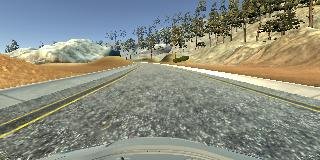
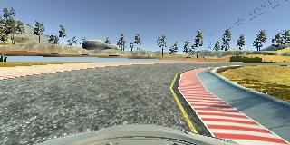
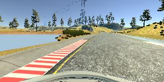

# **Behavioral Cloning** 

## Ren Silva - Udacity


[//]: # (Image References)

[image1]: ./examples/placeholder.png "Model Visualization"
[image2]: ./examples/placeholder.png "Grayscaling"
[image3]: ./examples/placeholder_small.png "Recovery Image"
[image4]: ./examples/placeholder_small.png "Recovery Image"
[image5]: ./examples/placeholder_small.png "Recovery Image"
[image6]: ./examples/placeholder_small.png "Normal Image"
[image7]: ./examples/placeholder_small.png "Flipped Image"


---
### Files Submitted & Code Quality

#### 1. Submission includes all required files and can be used to run the simulator in autonomous mode

My project includes the following files:
* model.py containing the script to create and train the model
* drive.py for driving the car in autonomous mode
* **model.h5** containing a trained convolution neural network 
* **writeup_report.md** (this file) summarizing the results

#### 2. Submission includes functional code
Using the Udacity provided simulator and my drive.py file, the car can be driven autonomously around the track by executing 
```sh
python drive.py model.h5
```

#### 3. Submission code is usable and readable

The model.py file contains the code for training and saving the convolution neural network. The file shows the pipeline I used for training and validating the model, and it contains comments to explain how the code works.

### Model Architecture and Training Strategy

#### 1. An appropriate model architecture has been employed

My model consists of a convolution neural network with 3x3 filter sizes and depths between 32 and 128 (model.py lines 132-154) 

The model uses Relu activation to introduce nonlinearity (model.py lines 132-154), and the data is normalized in the model using a Keras lambda layer (code line 136). 

#### 2. Attempts to reduce overfitting in the model

The model contains dropout layers in order to reduce overfitting (model.py lines 149,151). 

The model was trained and validated on different data sets to ensure that the model was not overfitting (code line 91). The model was tested by running it through the simulator and ensuring that the vehicle could stay on the track.

#### 3. Model parameter tuning

The model used an adam optimizer, so the learning rate was not tuned manually (model.py line 164).

#### 4. Appropriate training data

Training data was chosen to keep the vehicle driving on the road. I used a combination of center lane driving, recovering from the left and right sides of the road. 

In addition, I drove the track in both directions (the original direction, then I made a u-turn and followed the entire track in the oposite direction). I also  flipped each image during training.

For details about how I created the training data, see the next section. 

### Model Architecture and Training Strategy

#### 1. Solution Design Approach

The overall strategy for deriving a model architecture was to initialy create a very simplistic leNet model.

My first step was to use a convolution neural network model similar to the one we used in the previous assignment (traffic line recognition), wiht one twist: no activation on the last layer, as this is a regression problem.

I thought this model might be appropriate because the model needs to make sense of the visual information: colors, patterns, textures. Convolutional networks are ideal for this sort of problems.

In order to gauge how well the model was working, I split my image and steering angle data into a training and validation set. 

I found that my first model had a low mean squared error on the training set but a high mean squared error on the validation set. This implied that the model was overfitting. 

To combat the overfitting, I modified the model so that it included dropout layers afer each dense layer.

I also tried to use transfer learning with Inception, but found that my original CNN was, in fact, resulting in lower loss.

The next step was to run the simulator to see how well the car was driving around track one. I notice that, despite all the changes, the vehicle would start well, but would always end up turning into a dirt road to the right.

To correct that, I added a Lambda layer to discard the top part of the image (line 134), but this did not totally resolve the problem. 

Discussing the problem with a non-techincal friend, and explaining my frustration, he suggested I looked at how the model was "seeing" colors. 

That was when I realized that I was training the model with BRG images (read with opencv), but inference was being done with RGB images. I then corrected the data generator for that, introducing a conversion from BGR to RGB (line 107).

The final step was to run the simulator to see how well the car was driving around track one - and now it was driving pretty much the same way as I did.

(NB - I drove like a race driver, making use of the entire track, driving straight for as long as possible, so going from zebra to zebra) - and that was very much how my autonomous car behaves.

At the end of the process, the vehicle is able to drive autonomously around the track without leaving the road.

#### 2. Final Model Architecture

The final model architecture (model.py lines 18-24) consisted of a convolution neural network with the architecture shown below:

   _________________________________________________________________
    Layer (type)                 Output Shape              Param #   
    =================================================================
    cropping2d_1 (Cropping2D)    (None, 80, 320, 3)        0         
    _________________________________________________________________
    lambda_1 (Lambda)            (None, 80, 320, 3)        0         
    _________________________________________________________________
    conv2d_1 (Conv2D)            (None, 78, 318, 16)       448       
    _________________________________________________________________
    max_pooling2d_1 (MaxPooling2 (None, 39, 159, 16)       0         
    _________________________________________________________________
    conv2d_2 (Conv2D)            (None, 37, 157, 32)       4640      
    _________________________________________________________________
    max_pooling2d_2 (MaxPooling2 (None, 18, 78, 32)        0         
    _________________________________________________________________
    conv2d_3 (Conv2D)            (None, 16, 76, 64)        18496     
    _________________________________________________________________
    max_pooling2d_3 (MaxPooling2 (None, 8, 38, 64)         0         
    _________________________________________________________________
    conv2d_4 (Conv2D)            (None, 6, 36, 128)        73856     
    _________________________________________________________________
    max_pooling2d_4 (MaxPooling2 (None, 3, 18, 128)        0         
    _________________________________________________________________
    flatten_1 (Flatten)          (None, 6912)              0         
    _________________________________________________________________
    dense_1 (Dense)              (None, 512)               3539456   
    _________________________________________________________________
    dropout_1 (Dropout)          (None, 512)               0         
    _________________________________________________________________
    dense_2 (Dense)              (None, 128)               65664     
    _________________________________________________________________
    dropout_2 (Dropout)          (None, 128)               0         
    _________________________________________________________________
    dense_3 (Dense)              (None, 1)                 129       
    =================================================================
    Total params: 3,702,689
    Trainable params: 3,702,689
    Non-trainable params: 0
    _________________________________________________________________

#### 3. Creation of the Training Set & Training Process

To capture good fast driving behavior, I recorded the vehicle driving in the normal direction, making use of the entire track. 

It would be either driving in the center, like this:



Or negotiating the curves like a race-car driver, approaching curves like this:



And finishing wide the curves like this:




Then I repeated this process going in the oposite direction on the same track (I did a u-turn and drove again). Curiously, I found the track a lot easier when driving in the oposite direction.

I augmented the dataset by flipping each and every image. I did that inside the data generator (so the flipped images were not saved).

After the collection process, I had 10,231 data points (double that, when I flipped). 

However, I discarded the tail of each dataset (because, when I was training, I ended up crashing the car, so I did not want to include that).

After discarding the unwanted data points, I ended up with 8,931 images (17,862 when flipped)

I finally randomly shuffled the data set and put 20% of the data into a validation set. 

Whthin the model, I preprocessed the data by removing the top half (as this was causing more harm than good), and by normalizing the data (deducting mean and dividing by standard deviation). 

I used this training data for training the model. The validation set helped determine if the model was over or under fitting. 

The ideal number of epochs was 20 - at that point, the validation loss was no longer decreasing. 

I saved the lowest validation loss for the model, during training (I used a keras callback to do that)

I used an adam optimizer so that manually training the learning rate wasn't necessary.
